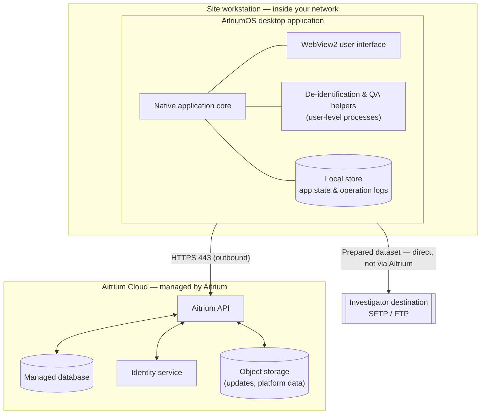

AitriumOS is a native desktop application. The user interface runs in the operating system's WebView; the application core runs as a compiled native process. It is an outbound client — there is no customer-hosted server, database, or inbound network service.

## On the workstation

- A single native desktop application ("AitriumOS").
- A user-interface layer rendered in the Microsoft Edge **WebView2** runtime (included with Windows 11).
- A small local database and working folders in the per-user application-data directory, holding application state and in-progress dataset processing — not a copy of your imaging archive.
- Bundled helper components for imaging tasks (e.g., DICOM de-identification and dose-volume-histogram computation) that run as ordinary, user-level processes and require no special privileges.

## In Aitrium's cloud (managed by Aitrium)

You install nothing server-side. The cloud platform comprises:

- An authenticated API the application calls for trial definitions, policies, and dataset-completeness records.
- A managed database and object storage (platform data and application-update artifacts).
- A managed identity service for sign-in.

<Note>
  There is no customer-hosted database, no inbound network service, and nothing to operate on your side beyond the desktop application itself.
</Note>

## System diagram

<a href="https://app.eraser.io/workspace/sBxvYQgwaUKl1rtLxLY0?figure=LK1SRZoqtHYv5bX9im85S">View on Eraser </a>

<Card title="Interactive version" icon="external-link" href="https://app.eraser.io/workspace/sBxvYQgwaUKl1rtLxLY0?origin=share">
  Open the full, interactive system architecture diagram.
</Card>
