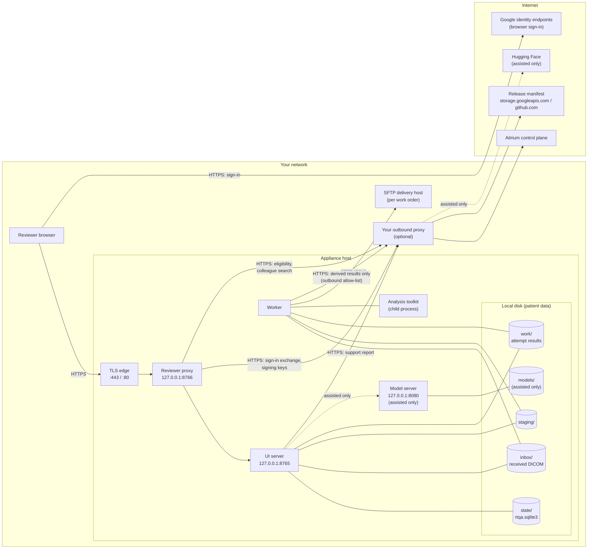

import { Audience } from '/snippets/audience.mdx';

<Audience who="Security and compliance reviewers · Trial organization IT" />

The Aitrium RTQA appliance is a small set of processes on one Linux host. Reviewers' browsers reach it through a TLS edge. A worker process polls Aitrium's control plane for work, fetches each trial delivery, and runs the QA analysis. Everything the review needs is stored on the host's local disks.

## Processes

| Process | systemd unit | Listens on | Role |
|---|---|---|---|
| **TLS edge** (Caddy), built-in edge only | `aitrium-rtqa-ingress.service` | `:443`, and `:80` to redirect, on all addresses | Terminates TLS with your certificate and forwards to the reviewer proxy on loopback. A pinned, checksum-verified static binary. |
| **Reviewer proxy** | `aitrium-rtqa-proxy.service` | `127.0.0.1:8766` by default | The only process users are meant to reach. Handles sign-in, scopes requests to your organization, serves the public `/status` and `/healthz`, the first-run wizard, and the admin console routes. Strips any identity headers a client sends and adds verified ones. |
| **UI server** | `aitrium-rtqa-ui.service` | `127.0.0.1:8765`, loopback only (it refuses any other address) | Answers only requests from the reviewer proxy (and local tools holding the proxy's secret). The review API, the static application, the review-state database, the image-access audit, and the assistant client. |
| **Worker** | `aitrium-rtqa-worker.service` | Nothing | Polls the control plane for work orders, fetches deliveries (SFTP or a local folder), runs the analysis toolkit, writes results, and posts status events. |
| **Analysis toolkit** | Started by the worker or UI server as a child process | Nothing | Radiotherapy DICOM analysis: inspection and dose-volume histograms. |
| **Model server** (assisted profile only) | `aitrium-llama.service` | `127.0.0.1:8080` | Local llama.cpp inference. Absent on a review install. |

On a Linux install run as root, every process runs as the unprivileged service account `aitrium-rtqa`. The exception is an existing install whose paths that account cannot reach, which keeps running as root (see [Data protection](/security/rtqa-appliance/data-protection#the-service-account-and-hardened-units)). Without root, the processes run as the installing user; on macOS, as the user who starts them.

With `--ingress external`, your own reverse proxy plays the edge's role and forwards to `127.0.0.1:8766`. With `--ingress none`, there is no edge and the appliance answers on loopback only.

## Storage

| Zone | Default path | Setting | Holds | Class |
|---|---|---|---|---|
| **State** | `<work dir>/state` | `RTQA_STATE_DIR` | The review-state database `rtqa.sqlite3` (sessions, findings, reports, the received-case catalog, audit tables, setup completion, reclaim records), delivery lock files, the proxy secret, and the recorded SFTP host keys | Patient data |
| **Received** | `<work dir>/inbox` | `RTQA_DATA_RECEIVED_DIR` | Delivered DICOM, one folder per site contribution, plus the downloaded archive (`RTQA_INGEST_KEEP_ARCHIVES`, default `true`) | Patient data |
| **Staging** | `<work dir>/staging` | `RTQA_DATA_STAGING_DIR` | Working copies of DICOM and supplemental inputs (for example REDCap data) for each processing attempt | Patient data |
| **Attempt results** | `<work dir>/work/<work order>/attempts/<attempt>/` | under the work directory | QA results for each attempt (summary, inspection, plan facts, decisions, reports) and its logs | Patient data |
| **Models** (assisted only) | `<work dir>/models` | `RTQA_APP_MODEL_DIR` | AI model weights | Not patient data |
| **Work directory** | `/opt/aitrium/rtqa` | `RTQA_WORK_DIR` | The configuration file `.env`, `secrets/`, the one-time setup token, the install record, `logs/`, the Python environment, launchers, systemd units, and the edge's configuration and state | Configuration and secrets |

- The state directory must be on local block storage. The preflight blocks NFS and SMB for it.
- The `work/` zone holds patient data just like received and staging, so it needs the same encryption, backup, and retention decisions. Storage reclaim does not remove it.
- The appliance does not encrypt any of these zones. See [Data protection: Encryption](/security/rtqa-appliance/data-protection#encryption).

## Network paths

### What flows where

- **Browser → edge → proxy → UI server.** All reviewer traffic. Images are streamed from the UI server to the browser and held in the viewer's memory for that page only. They are answered `Cache-Control: no-store`, so compliant browsers and caches in the path must not store them. That does not guarantee patient data never reaches a workstation's disk (see [Known limits](/security/rtqa-appliance/known-limits)). Reviewers can download a case report as Markdown and print it, and administrators can export SQL console results as CSV. Those copies leave appliance storage and need protecting on the workstation. Anything a browser shows can also be screen-captured.
- **Worker → control plane.** Polling, claiming work orders, reading the bootstrap bundle (protocol and QA rules), and posting status events, all through the outbound allow-list.
- **Worker → SFTP delivery host.** Downloads the trial delivery for a work order. The host and credentials come from the control plane for each work order. The credentials are encrypted (AES-GCM) in the API response, on top of TLS.
- **Worker → REDCap**, when a trial uses it. Supplemental case data, if a work order names a REDCap input. The appliance posts the REDCap token and the record locator the control plane supplied, and stores the answer locally in staging.
- **Proxy → control plane.** The reviewer sign-in exchange, and the public signing keys (JWKS).
- **UI server → control plane.** Support reports, through the outbound allow-list.
- **Proxy → control plane (collaboration).** Reviewer-eligibility checks and colleague search, through the outbound allow-list.
- **Browser → Google identity endpoints.** The reviewer's browser signs in to an Aitrium account (Firebase Authentication). This is browser traffic, not appliance traffic.

Inside the host, the edge → proxy → UI server hops are plain HTTP on the loopback interface. See [Data protection: In transit](/security/rtqa-appliance/data-protection#in-transit).

For each route and what it carries, see [Data flows and network](/security/rtqa-appliance/data-flows).
